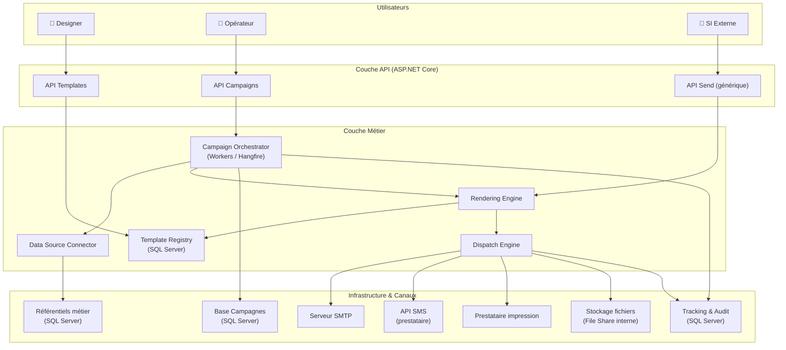
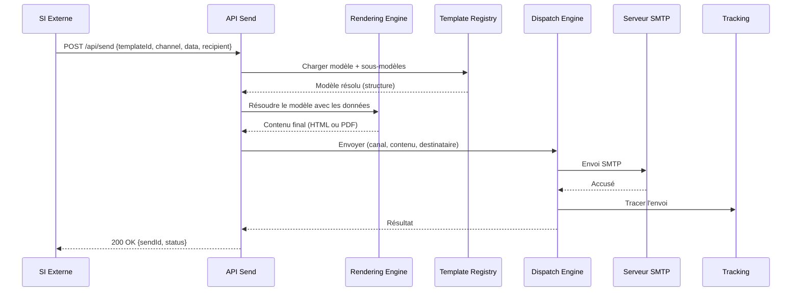
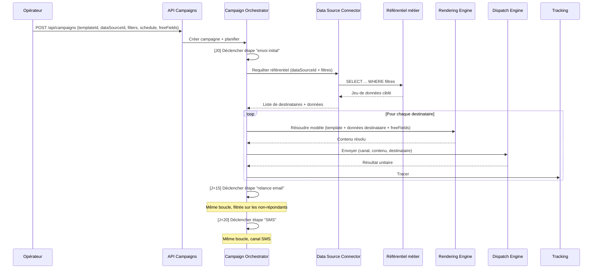
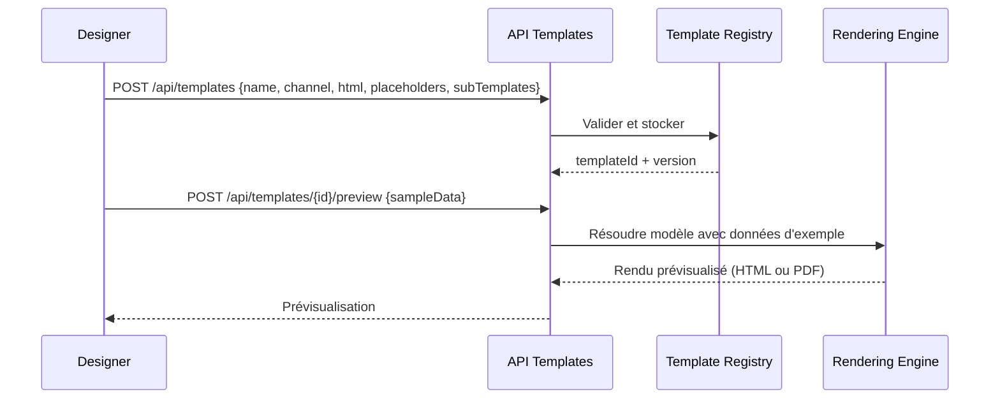
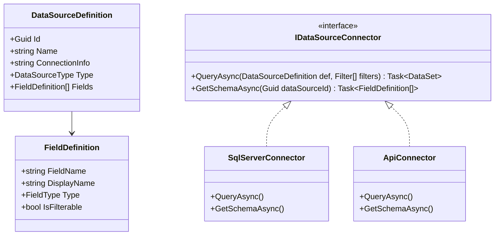
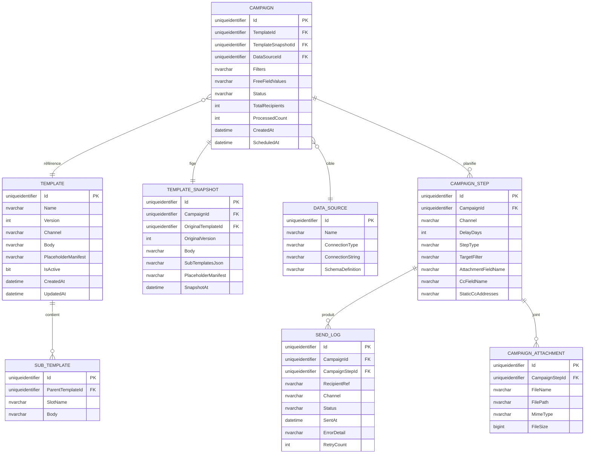
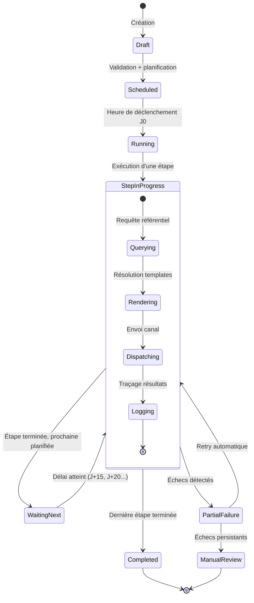
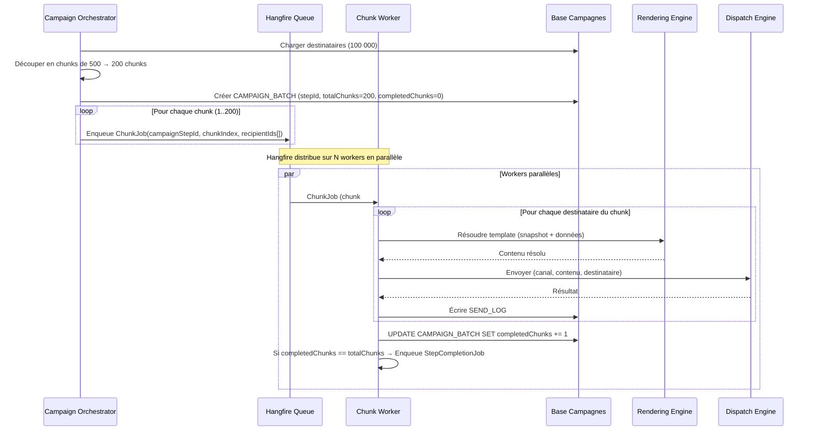

# Étude d'architecture — Moteur de campagnes multicanal

## 1. Analyse de cohérence de l'idée initiale

L'architecture proposée est solide et bien pensée. La séparation en briques distinctes (moteur d'envoi, planification, référentiel de modèles, génération PDF, connecteur SMS) respecte les principes fondamentaux d'une architecture modulaire. Plusieurs points forts méritent d'être soulignés.

**Ce qui fonctionne bien :**

- La distinction Designer / Opérateur est claire et reflète des préoccupations métier réellement distinctes. Cela se traduit naturellement en périmètres de sécurité et en surfaces API séparées.
- L'idée d'un moteur d'envoi générique exposé en API, découplé de l'outil de campagne, est un excellent choix. Cela permet une réutilisation large (SI tiers, workflows automatisés, campagnes manuelles) sans duplication de logique.
- L'extensibilité des référentiels est identifiée comme un enjeu dès le départ, ce qui évitera un couplage fort avec un modèle métier spécifique.

**Points à affiner ou challenger :**

- La frontière entre le "moteur d'envoi" et le "moteur de planification" mérite d'être précisée. Le moteur d'envoi devrait être purement synchrone et unitaire (envoyer UN message avec UN modèle et DES données), tandis que le planificateur orchestre des lots et des séquences temporelles. Cette distinction est implicite dans le prompt mais doit être rendue explicite dans l'architecture.
- La gestion des référentiels de données est le point le plus complexe. Il faut distinguer clairement la déclaration d'un référentiel (métadonnées, schéma), l'accès aux données (connecteur ou import), et le ciblage (filtres appliqués par l'opérateur). Ces trois responsabilités ne doivent pas être mélangées.
- Le module de génération PDF est présenté comme une brique dédiée, mais il est en réalité un cas particulier du rendu de modèle. Il serait plus cohérent de le traiter comme un "renderer" parmi d'autres (HTML pour email, PDF pour courrier), piloté par le canal choisi.

---

## 2. Cartographie des briques techniques

### 2.1 Vue d'ensemble des briques

| Brique | Responsabilité | Consommateurs |
|--------|---------------|---------------|
| **Template Registry** | Stockage et versioning des modèles, sous-modèles et dictionnaires | Designer (CRUD), Rendering Engine (lecture) |
| **Rendering Engine** | Résolution des modèles : substitution clé-valeur, évaluation des contenus dynamiques, production du rendu final (HTML ou PDF) | Dispatch Engine, API externe |
| **Dispatch Engine** | Envoi unitaire d'un message résolu sur un canal donné (email via SMTP, SMS via API, PDF vers prestataire) | Campaign Orchestrator, API externe |
| **Campaign Orchestrator** | Planification et exécution des campagnes : ciblage, séquençage, relances, suivi d'état | Opérateur (via UI/API) |
| **Data Source Connector** | Abstraction d'accès aux référentiels de données : déclaration de schéma, requêtage, filtrage | Campaign Orchestrator |
| **Tracking & Audit** | Journal centralisé de toutes les actions : envois, erreurs, relances. Le tracking d'ouverture et de clics est reporté à une itération ultérieure. | Toutes les briques (écriture), Opérateur/Admin (lecture) |
| **Identity & Access** | Authentification, autorisation, gestion des profils Designer/Opérateur | Toutes les briques |

### 2.2 Diagramme de briques (C4 — niveau conteneur)



---

## 3. Flux principaux

### 3.1 Flux 1 — Envoi unitaire via API (SI externe)

Ce flux correspond à l'usage le plus simple : un système tiers envoie un message ponctuel.



**Données circulantes :** l'appel initial contient l'identifiant du modèle, le canal souhaité, un dictionnaire clé-valeur pour la substitution, et les coordonnées du destinataire. Le retour contient un identifiant de traçabilité.

### 3.2 Flux 2 — Exécution d'une campagne planifiée

Ce flux est le cœur du système pour l'Opérateur.



### 3.3 Flux 3 — Conception d'un modèle (Designer)



---

## 4. Approche de templétisation

C'est le cœur technique du système. Voici une proposition structurée.

### 4.1 Modèle de données du template

Un template est composé de trois couches :

**Couche 1 — Structure du modèle**

```
Template
├── Id (GUID)
├── Name
├── Version (int, auto-incrémenté)
├── Channel (Email | Letter | SMS)
├── Body (contenu brut : HTML, texte, ou markup PDF)
├── SubTemplates[] (composition : header, footer, blocs réutilisables)
└── PlaceholderManifest (déclaration des variables attendues)
```

**Couche 2 — Manifeste des placeholders**

Chaque placeholder est typé et décrit dans un manifeste JSON embarqué dans le template :

```json
{
  "placeholders": [
    {
      "key": "client.nom",
      "type": "scalar",
      "required": true,
      "source": "datasource"
    },
    {
      "key": "message_personnalise",
      "type": "scalar",
      "required": false,
      "source": "freeField",
      "label": "Message personnalisé pour le destinataire"
    },
    {
      "key": "lignes_contrat",
      "type": "table",
      "columns": ["reference", "date_debut", "montant"],
      "source": "datasource"
    },
    {
      "key": "liste_avantages",
      "type": "list",
      "source": "datasource"
    }
  ]
}
```

Les quatre types de données supportés sont `scalar` (valeur simple substituée dans le texte), `table` (génère un tableau HTML ou PDF à partir d'un jeu de lignes/colonnes), `list` (génère une liste à puces ou numérotée), et `freeField` (valeur saisie par l'opérateur au lancement de la campagne, commune à tous les envois).

**Couche 3 — Syntaxe de substitution dans le corps**

La syntaxe proposée s'inspire des moteurs de templates éprouvés tout en restant simple :

```html
<!-- Scalaire -->
<p>Bonjour {{client.prenom}} {{client.nom}},</p>

<!-- Zone libre (saisie opérateur) -->
<p>{{message_personnalise}}</p>

<!-- Tableau dynamique -->
{{#table lignes_contrat}}
<table>
  <thead><tr><th>Référence</th><th>Date début</th><th>Montant</th></tr></thead>
  <tbody>
    {{#row}}<tr><td>{{reference}}</td><td>{{date_debut}}</td><td>{{montant}}</td></tr>{{/row}}
  </tbody>
</table>
{{/table}}

<!-- Liste dynamique -->
<ul>
{{#list liste_avantages}}
  <li>{{.}}</li>
{{/list}}
</ul>

<!-- Bloc conditionnel -->
{{#if client.a_contrat_actif}}
  <p>Votre contrat est toujours actif.</p>
{{/if}}
```

### 4.2 Moteur de résolution (Rendering Engine)

Le Rendering Engine opère en pipeline :

```
1. Charger le template + sous-templates → assembler le body complet
2. Valider les données fournies contre le PlaceholderManifest
3. Résoudre les blocs conditionnels ({{#if}})
4. Résoudre les tables et listes ({{#table}}, {{#list}})
5. Résoudre les scalaires ({{key}})
6. Post-traitement selon le canal :
   - Email → sanitization HTML, inlining CSS
   - Letter → conversion HTML → PDF (via wkhtmltopdf ou Puppeteer)
   - SMS → extraction texte brut, troncature
```

En C#, il est recommandé de ne pas réinventer la roue : des moteurs comme Scriban ou Fluid (ports de Liquid) offrent une syntaxe similaire, sont extensibles, et gèrent nativement les boucles, conditions et filtres. Ils peuvent être encapsulés derrière une interface `ITemplateRenderer` pour rester substituables.

```csharp
public interface ITemplateRenderer
{
    string Resolve(string templateBody, IDictionary<string, object> data);
}

public interface IChannelRenderer
{
    byte[] Render(string resolvedContent, ChannelType channel);
    // Retourne HTML pour email, PDF bytes pour courrier, texte pour SMS
}
```

### 4.3 Distinction mail vs courrier

La différence entre email et courrier ne devrait pas être dans le moteur de substitution (identique) mais dans le post-traitement :

| Aspect | Email | Courrier (PDF) | SMS |
|--------|-------|----------------|-----|
| Corps source | HTML complet | HTML avec zones d'entête spécifiques | Texte brut ou mini-template |
| Sous-modèles typiques | Header, footer, signature | Entête officiel, pied de page légal, adresse fenêtre | Aucun |
| Post-traitement | CSS inlining, image embedding | HTML → PDF (wkhtmltopdf), consolidation multi-pages | Troncature, segmentation |
| Sortie | Message SMTP | Fichier PDF (lot ou unitaire) | Appel API prestataire |

---

## 5. Points de variabilité et stratégie d'extension

### 5.1 Ajout d'un nouveau canal

L'architecture doit permettre d'ajouter un canal (ex : notification push, WhatsApp) sans toucher au cœur du système.

**Pattern proposé : Strategy + Registry**

```csharp
public interface IChannelDispatcher
{
    ChannelType Channel { get; }
    Task<SendResult> SendAsync(DispatchRequest request);
}

// Enregistrement par DI
services.AddScoped<IChannelDispatcher, SmtpEmailDispatcher>();
services.AddScoped<IChannelDispatcher, SmsApiDispatcher>();
services.AddScoped<IChannelDispatcher, PdfLetterDispatcher>();
// Nouveau canal :
services.AddScoped<IChannelDispatcher, WhatsAppDispatcher>();
```

Le Dispatch Engine sélectionne le bon dispatcher via le type de canal demandé. Aucun `switch/case` en dur : la résolution se fait par injection de dépendances.

### 5.2 Ajout d'un nouveau référentiel de données

Le Data Source Connector doit être agnostique du schéma métier. Voici l'approche recommandée :



Chaque référentiel est déclaré via une `DataSourceDefinition` qui décrit son schéma (champs, types, filtrabilité) et sa source (SQL Server, API REST, fichier CSV importé). L'opérateur ne voit que les champs exposés et peut construire ses filtres sur cette base. Le système ne connaît jamais directement le modèle métier "client" ou "collaborateur" — il manipule des `DataSourceDefinition` génériques.

### 5.3 Nouveaux consommateurs de l'API

L'API Send est déjà conçue pour être autonome. Pour la rendre réellement ouverte, il faut prévoir des mécanismes d'API key ou OAuth2 (client credentials) pour les SI tiers, un rate limiting par consommateur, une documentation OpenAPI/Swagger auto-générée, et des webhooks pour notifier les appelants du statut d'un envoi (envoyé, échoué, ouvert).

---

## 6. Modèle de données simplifié



---

## 7. Risques et questions ouvertes

### 7.1 Risques techniques identifiés

**R1 — Volumétrie et performance des envois en lot.** Une campagne peut cibler jusqu'à 100 000 destinataires. Le Rendering Engine sera sollicité en boucle. Le batching est géré par Hangfire Community (sans licence Pro) via un pattern de découpage en chunks décrit en section 10. Il faut prévoir un throttling (respect des limites SMTP et des APIs SMS). La résolution des templates en amont avec stockage temporaire des rendus permet de découpler rendu et envoi, et de reprendre en cas d'échec partiel.

**R2 — Gestion des échecs et reprise.** Un envoi SMTP peut échouer, une API SMS peut être indisponible. Chaque envoi unitaire doit avoir un statut persisté (Pending, Sent, Failed, Retrying) et une politique de retry configurable (exponential backoff). Le SEND_LOG est la table clé pour cela.

**R3 — Rendu HTML email fiable.** Le HTML email est notoirement hostile (pas de CSS grid, support partiel de flexbox, clients mail avec des comportements divergents). Le moteur doit produire un HTML compatible via CSS inlining (ex : PreMailer.Net) et être testé sur les principaux clients (Outlook, Gmail, Apple Mail). C'est un sujet à part entière qui peut justifier l'intégration d'un outil comme MJML comme couche d'abstraction.

**R4 — Sécurité des templates.** Si le Designer peut insérer du HTML arbitraire, cela ouvre la porte aux injections XSS dans les emails. Il faut un processus de sanitization contrôlé : le moteur doit échapper les données injectées (les valeurs substituées), pas le template lui-même.

**R5 — Consolidation PDF pour les courriers.** Le prestataire postal attend souvent un fichier PDF consolidé (toutes les lettres dans un seul fichier, avec des marques de coupure). La génération unitaire de PDF doit être suivie d'une étape de concaténation. Des outils comme PdfSharp ou iText (attention à la licence) peuvent gérer cela.

### 7.2 Décisions architecturales prises

| # | Question | Décision | Conséquences sur la conception |
|---|----------|----------|-------------------------------|
| Q1 | Quel moteur de template C# adopter ? | **Scriban** — léger, sandbox natif, syntaxe Liquid-like, extensible | L'interface `ITemplateRenderer` encapsule Scriban. La syntaxe des templates suit les conventions Scriban (`{{ }}`, `for`, `if`). Pas de moteur maison. |
| Q2 | Comment gérer le versioning des templates ? | **Snapshot au lancement de la campagne.** Les modifications ne s'appliquent qu'aux nouvelles campagnes. | Une table `TEMPLATE_SNAPSHOT` stocke une copie figée (body + sous-templates + manifeste) liée à la campagne. Cela garantit la traçabilité : on peut toujours reconstituer exactement le contenu envoyé. |
| Q3 | Comment sont gérés les filtres de ciblage ? | **Expression arborescente (AST)** côté API, traduite en SQL paramétré par le connecteur | Le modèle de filtre est un arbre d'expressions (opérateurs logiques + comparaisons). Le `DataSourceConnector` traduit cet AST en `WHERE` paramétré. Jamais de SQL brut exposé à l'opérateur. |
| Q4 | Hangfire ou bus de messages ? | **Hangfire** en version gratuite (Community), sans licence Pro | Le batching est implémenté manuellement via un pattern de découpage en chunks + enqueue de jobs unitaires (voir section 10). Si la volumétrie dépasse largement 100 000 envois/jour à terme, envisager un bus dédié. |
| Q5 | Suivi des ouvertures email et clics ? | **Reporté** — hors périmètre initial | Le SEND_LOG trace les envois (Sent/Failed). Le tracking d'ouverture (pixel) et de clics (redirect) sera ajouté dans une itération ultérieure. |
| Q6 | Gestion multi-tenant ? | **Non applicable** — outil interne mono-organisation | Aucune colonne TenantId, aucune isolation par schéma. Simplifie le modèle de données et la sécurité. |
| Q7 | Comment le Designer teste-t-il un modèle ? | **Requête d'échantillon en lecture seule** sur le référentiel de données | L'API Templates expose un endpoint `GET /api/templates/{id}/preview?dataSourceId={ds}&sampleSize=5` qui requête un échantillon du référentiel en mode lecture seule et résout le template avec ces données réelles. |

### 7.3 Risques organisationnels

La gouvernance des modèles nécessite un workflow de validation (brouillon → en revue → publié → archivé). Sans ce workflow, le risque est qu'un modèle incomplet soit utilisé en production. De même, la gestion des droits doit empêcher un Opérateur de modifier un modèle, et un Designer de lancer une campagne.

---

## 8. Architecture d'orchestration d'une campagne



---

## 9. Snapshot des templates au lancement

Le snapshot est un mécanisme de protection de l'intégrité des campagnes. Lorsqu'une campagne passe de l'état `Draft` à `Scheduled`, le système fige une copie complète du template (body, sous-templates, manifeste) dans la table `TEMPLATE_SNAPSHOT`. Tous les envois de cette campagne — y compris les relances à J+15 ou J+20 — utilisent exclusivement ce snapshot.

**Avantages :**

- Le Designer peut continuer à modifier le template vivant sans impacter les campagnes en cours
- La traçabilité est parfaite : on peut toujours reconstituer exactement le contenu envoyé à chaque destinataire
- En cas d'audit ou de litige, le snapshot fait office de preuve

**Implémentation :**

```csharp
public class TemplateSnapshotService
{
    public async Task<TemplateSnapshot> CreateSnapshotAsync(Guid campaignId, Guid templateId)
    {
        var template = await _templateRegistry.GetWithSubTemplatesAsync(templateId);

        var snapshot = new TemplateSnapshot
        {
            Id = Guid.NewGuid(),
            CampaignId = campaignId,
            OriginalTemplateId = template.Id,
            OriginalVersion = template.Version,
            Body = template.Body,
            SubTemplatesJson = JsonSerializer.Serialize(template.SubTemplates),
            PlaceholderManifest = template.PlaceholderManifest,
            SnapshotAt = DateTime.UtcNow
        };

        await _snapshotRepository.SaveAsync(snapshot);
        return snapshot;
    }
}
```

Le Rendering Engine, lorsqu'il est appelé par le Campaign Orchestrator, charge le snapshot (via `TemplateSnapshotId` sur la campagne) et non le template vivant. En revanche, l'API Send unitaire (SI externe) continue d'utiliser la dernière version active du template — il n'y a pas de notion de campagne dans ce flux.

---

## 10. Stratégie de batching avec Hangfire Community

### 10.1 Contrainte : pas de licence Pro

Hangfire Pro offre nativement `BatchJob.StartNew()` qui regroupe des jobs et déclenche une continuation quand tous sont terminés. En version Community (gratuite), cette fonctionnalité n'existe pas. Il faut donc implémenter un mécanisme de batching logique.

### 10.2 Pattern proposé : Chunk Coordinator

Le principe est simple : le Campaign Orchestrator découpe la population de destinataires en **chunks** (ex : 500 destinataires par chunk), enqueue un job Hangfire par chunk, et un mécanisme de coordination détecte quand tous les chunks d'une étape sont terminés.



### 10.3 Implémentation C#

```csharp
public class CampaignBatchService
{
    private const int ChunkSize = 500;

    public async Task LaunchStepAsync(Guid campaignStepId)
    {
        var step = await _stepRepository.GetAsync(campaignStepId);
        var campaign = await _campaignRepository.GetAsync(step.CampaignId);

        // Récupérer tous les destinataires ciblés
        var recipients = await _dataSourceConnector.QueryAsync(
            campaign.DataSourceId, step.TargetFilter);

        // Découper en chunks
        var chunks = recipients
            .Select((r, i) => new { Recipient = r, Index = i })
            .GroupBy(x => x.Index / ChunkSize)
            .Select(g => g.Select(x => x.Recipient).ToList())
            .ToList();

        // Créer le tracker de batch
        var batch = new CampaignBatch
        {
            Id = Guid.NewGuid(),
            CampaignStepId = campaignStepId,
            TotalChunks = chunks.Count,
            CompletedChunks = 0,
            Status = BatchStatus.Running
        };
        await _batchRepository.SaveAsync(batch);

        // Enqueue un job par chunk
        for (int i = 0; i < chunks.Count; i++)
        {
            var recipientIds = chunks[i].Select(r => r.Id).ToList();
            BackgroundJob.Enqueue<ChunkWorker>(
                w => w.ProcessChunkAsync(batch.Id, campaignStepId, recipientIds));
        }
    }
}

public class ChunkWorker
{
    [AutomaticRetry(Attempts = 3, DelaysInSeconds = new[] { 30, 120, 600 })]
    public async Task ProcessChunkAsync(
        Guid batchId, Guid campaignStepId, List<Guid> recipientIds)
    {
        var step = await _stepRepository.GetAsync(campaignStepId);
        var campaign = await _campaignRepository.GetAsync(step.CampaignId);
        var snapshot = await _snapshotRepository.GetAsync(campaign.TemplateSnapshotId);

        // Charger les PJ statiques une seule fois pour tout le chunk
        var staticAttachments = await _attachmentRepository
            .GetForStepAsync(campaignStepId);

        foreach (var recipientId in recipientIds)
        {
            var data = await _dataSourceConnector.GetRecipientDataAsync(
                campaign.DataSourceId, recipientId);

            try
            {
                var content = _renderingEngine.Resolve(snapshot, data, campaign.FreeFieldValues);

                // Résoudre PJ statiques + PJ dynamique du destinataire
                var attachments = await _attachmentResolver
                    .ResolveAsync(step, data, staticAttachments);

                // Résoudre les CC (statiques + dynamiques)
                var ccAddresses = CcResolver.ResolveCcAddresses(step, data);

                var result = await _dispatchEngine.SendAsync(new DispatchRequest
                {
                    Channel = step.Channel,
                    Content = content,
                    Recipient = data.ContactInfo,
                    CcAddresses = ccAddresses,
                    Attachments = attachments
                });

                await _sendLogRepository.LogAsync(campaignStepId, recipientId,
                    result.Success ? SendStatus.Sent : SendStatus.Failed,
                    result.ErrorDetail);
            }
            catch (Exception ex)
            {
                await _sendLogRepository.LogAsync(campaignStepId, recipientId,
                    SendStatus.Failed, ex.Message);
            }
        }

        // Incrémenter atomiquement le compteur de chunks terminés
        var allDone = await _batchRepository.IncrementCompletedAsync(batchId);
        if (allDone)
        {
            BackgroundJob.Enqueue<StepCompletionHandler>(
                h => h.HandleStepCompletedAsync(campaignStepId));
        }
    }
}
```

### 10.4 Incrémentation atomique du compteur

Le point critique est l'incrémentation concurrente du compteur `CompletedChunks`. Comme plusieurs workers s'exécutent en parallèle, il faut une opération atomique :

```sql
-- Procédure stockée ou requête inline
UPDATE CAMPAIGN_BATCH
SET CompletedChunks = CompletedChunks + 1
OUTPUT INSERTED.CompletedChunks, INSERTED.TotalChunks
WHERE Id = @BatchId;
-- Si CompletedChunks == TotalChunks → batch terminé
```

### 10.5 Dimensionnement

| Paramètre | Valeur recommandée | Justification |
|---|---|---|
| Taille de chunk | 500 destinataires | Assez gros pour limiter l'overhead Hangfire, assez petit pour un retry ciblé |
| Workers Hangfire | 4 à 8 (configurable) | Dépend du nombre de cœurs CPU et de la latence des canaux (SMTP, API SMS) |
| Retry par envoi unitaire | 3 tentatives, backoff 30s / 2min / 10min | Gère les indisponibilités transitoires sans surcharger |
| Retry par chunk | 3 tentatives (via `[AutomaticRetry]`) | Si le chunk entier échoue (ex : perte de connexion DB), il est relancé |
| Throttling SMTP | Configurable par canal | Respect des limites du serveur SMTP (ex : 100 messages/seconde) |

Pour 100 000 destinataires avec un chunk de 500, cela produit 200 jobs Hangfire. Avec 8 workers, chaque worker traite ~25 chunks. Si un envoi unitaire prend ~200ms (résolution template + envoi SMTP), un chunk de 500 prend ~100 secondes. Les 200 chunks s'exécutent en parallèle sur 8 workers, soit environ 25 × 100s ≈ **~42 minutes** pour l'ensemble de la campagne. Ce temps peut être réduit en augmentant le nombre de workers ou en pré-résolvant les templates.

---

## 11. Gestion des pièces jointes

### 11.1 Principes

Les pièces jointes sont stockées sur un **système de fichiers interne** (partage réseau / file share) accessible par les applicatifs. La base de données ne stocke que les métadonnées et le chemin vers le fichier physique.

Le modèle de pièces jointes est **dynamique par destinataire** : chaque destinataire peut avoir sa propre pièce jointe (ex : relevé de compte, attestation personnalisée). Le chemin vers le fichier est porté par un champ du référentiel de données. Si le champ est `null` ou si le fichier n'existe pas sur le file share, le Dispatch Engine envoie le message sans pièce jointe — ce n'est pas une erreur bloquante.

En complément, des pièces jointes **statiques** communes à tous les destinataires d'une étape restent possibles (ex : conditions générales PDF). Elles sont déposées par l'Opérateur lors de la configuration de l'étape.

### 11.2 Configuration au niveau de l'étape

L'Opérateur configure les pièces jointes dans `CAMPAIGN_STEP` via deux mécanismes complémentaires :

- **Champ dynamique** : l'Opérateur sélectionne un champ du référentiel qui contient le chemin fichier par destinataire. Ce champ est déclaré dans le `DataSourceDefinition` avec un type `FilePath`.
- **Pièces jointes statiques** : l'Opérateur dépose un ou plusieurs fichiers communs rattachés à l'étape.

```csharp
public class CampaignStep
{
    public Guid Id { get; set; }
    public Guid CampaignId { get; set; }
    public string Channel { get; set; }
    public int DelayDays { get; set; }
    public string StepType { get; set; }
    public string TargetFilter { get; set; }
    public string? AttachmentFieldName { get; set; }  // Champ du référentiel contenant le chemin PJ
    public string? CcFieldName { get; set; }           // Champ du référentiel contenant le(s) CC (optionnel)
    public string? StaticCcAddresses { get; set; }     // CC statiques (JSON array, optionnel)
}
```

### 11.3 Modèle de données des pièces jointes statiques

La table `CAMPAIGN_ATTACHMENT` gère uniquement les pièces jointes statiques rattachées à une étape :

```csharp
public class CampaignAttachment
{
    public Guid Id { get; set; }
    public Guid CampaignStepId { get; set; }
    public string FileName { get; set; }         // Nom affiché au destinataire
    public string FilePath { get; set; }          // Chemin UNC vers le fichier
    public string MimeType { get; set; }          // ex: application/pdf
    public long FileSize { get; set; }            // Taille en octets
}
```

Les pièces jointes dynamiques n'ont pas de table dédiée — leur chemin est lu directement depuis les données du destinataire à l'exécution.

### 11.4 Résolution des pièces jointes dans le Chunk Worker

Le `ChunkWorker` assemble les pièces jointes à partir de deux sources :

```csharp
public class AttachmentResolver
{
    private readonly IFileShareClient _fileShare;

    public async Task<List<AttachmentInfo>> ResolveAsync(
        CampaignStep step,
        IDictionary<string, object> recipientData,
        List<CampaignAttachment> staticAttachments)
    {
        var result = new List<AttachmentInfo>();

        // 1. Pièces jointes statiques (communes à tous les destinataires)
        foreach (var att in staticAttachments)
        {
            var data = await _fileShare.ReadFileAsync(att.FilePath);
            if (data != null)
                result.Add(new AttachmentInfo
                {
                    FileName = att.FileName,
                    MimeType = att.MimeType,
                    Data = data
                });
        }

        // 2. Pièce jointe dynamique (propre au destinataire)
        if (!string.IsNullOrEmpty(step.AttachmentFieldName)
            && recipientData.TryGetValue(step.AttachmentFieldName, out var pathObj)
            && pathObj is string filePath
            && !string.IsNullOrWhiteSpace(filePath))
        {
            var data = await _fileShare.ReadFileAsync(filePath);
            if (data != null)
            {
                result.Add(new AttachmentInfo
                {
                    FileName = Path.GetFileName(filePath),
                    MimeType = MimeTypeHelper.FromExtension(filePath),
                    Data = data
                });
            }
            // Si le fichier n'existe pas → on continue sans PJ, pas d'erreur bloquante
            // Un warning est tracé dans le SEND_LOG
        }

        return result;
    }
}
```

### 11.5 Gestion des copies carbone (CC)

Le CC est une information **optionnelle** qui peut être définie de deux manières complémentaires :

- **CC statique** : une liste d'adresses email définie par l'Opérateur au niveau de l'étape, commune à tous les envois (ex : le service juridique reçoit systématiquement une copie).
- **CC dynamique** : un champ du référentiel de données contenant une ou plusieurs adresses CC propres à chaque destinataire (ex : le gestionnaire de compte du client). Le champ peut contenir une adresse unique ou plusieurs séparées par un point-virgule.

Le `DispatchRequest` est enrichi pour transporter ces informations :

```csharp
public class DispatchRequest
{
    public ChannelType Channel { get; set; }
    public string Content { get; set; }
    public RecipientInfo Recipient { get; set; }
    public List<string> CcAddresses { get; set; } = new();
    public List<AttachmentInfo> Attachments { get; set; } = new();
}

public class AttachmentInfo
{
    public string FileName { get; set; }
    public string MimeType { get; set; }
    public byte[] Data { get; set; }
}
```

La résolution des CC dans le `ChunkWorker` :

```csharp
public static List<string> ResolveCcAddresses(
    CampaignStep step,
    IDictionary<string, object> recipientData)
{
    var cc = new List<string>();

    // CC statiques (définis par l'Opérateur sur l'étape)
    if (!string.IsNullOrEmpty(step.StaticCcAddresses))
    {
        var staticCc = JsonSerializer.Deserialize<List<string>>(step.StaticCcAddresses);
        if (staticCc != null) cc.AddRange(staticCc);
    }

    // CC dynamiques (issus du référentiel de données)
    if (!string.IsNullOrEmpty(step.CcFieldName)
        && recipientData.TryGetValue(step.CcFieldName, out var ccObj)
        && ccObj is string ccValue
        && !string.IsNullOrWhiteSpace(ccValue))
    {
        cc.AddRange(ccValue.Split(';', StringSplitOptions.RemoveEmptyEntries)
            .Select(e => e.Trim())
            .Where(e => !string.IsNullOrEmpty(e)));
    }

    return cc.Distinct(StringComparer.OrdinalIgnoreCase).ToList();
}
```

Le `SmtpEmailDispatcher` ajoute les adresses CC dans le champ `CC` du message MIME. Le `PdfLetterDispatcher` et le `SmsApiDispatcher` ignorent le CC (non applicable à ces canaux).

### 11.6 Contraintes et garde-fous

| Contrainte | Valeur suggérée | Justification |
|---|---|---|
| Taille max par pièce jointe | 10 Mo | Limite raisonnable pour les serveurs SMTP et la bande passante |
| Taille max cumulée par envoi | 25 Mo | Seuil courant des serveurs SMTP |
| Formats autorisés | PDF, DOCX, XLSX, PNG, JPG | Whitelist stricte pour éviter les exécutables |
| Fichier dynamique absent | Warning dans SEND_LOG, envoi sans PJ | Pas de blocage : un fichier manquant ne doit pas empêcher l'envoi du message |
| Validation statiques au lancement | Vérifier l'existence et l'accessibilité des PJ statiques **avant** de passer la campagne en `Scheduled` | Évite les échecs en masse si un chemin est invalide |
| CC : validation format | Vérifier que chaque adresse CC est un email syntaxiquement valide avant dispatch | Évite les rejets SMTP silencieux |

---

## 12. Synthèse et prochaines étapes recommandées

L'architecture proposée est cohérente et viable. Les décisions prises consolident les fondations. Les principes directeurs à retenir pour la phase suivante sont les suivants :

1. **Le moteur d'envoi est un microservice autonome** — il ne connaît que des templates, des données et des canaux. Il ne sait rien des campagnes.
2. **L'orchestrateur de campagnes est un consommateur du moteur d'envoi** — il ajoute la logique de ciblage, de séquençage et de suivi par-dessus.
3. **Les référentiels de données sont déclarés, pas codés en dur** — le système manipule des schémas génériques, pas des entités métier.
4. **Les canaux sont des plugins** — chaque canal implémente une interface commune, ce qui rend l'ajout d'un nouveau canal indolore.
5. **La traçabilité est transversale** — chaque brique contribue au journal d'audit, qui est la source de vérité pour le suivi opérationnel.
6. **L'intégrité des campagnes est garantie par snapshot** — le template est figé au lancement, les modifications n'impactent que les futures campagnes.
7. **Le batching est maîtrisé sans dépendance à une licence Pro** — le pattern Chunk Coordinator assure la parallélisation et le suivi de complétion.

**Prochaines étapes suggérées pour la conception détaillée :**

- Prototyper le Rendering Engine avec Scriban sur un cas concret (un email avec tableau dynamique, pièce jointe, et un courrier PDF)
- Définir le contrat OpenAPI de l'API Send et de l'API Campaigns
- Modéliser le schéma SQL Server complet avec les index et contraintes (incluant `TEMPLATE_SNAPSHOT`, `CAMPAIGN_BATCH`, `CAMPAIGN_ATTACHMENT`)
- Implémenter et tester le pattern Chunk Coordinator avec Hangfire Community sur un jeu de 100 000 destinataires simulés
- Maquetter le workflow Designer (éditeur de templates) pour valider l'ergonomie
- Réaliser un POC de génération PDF depuis HTML (wkhtmltopdf vs Puppeteer vs DinkToPdf)
- Valider l'accès au file share interne depuis les workers Hangfire (permissions réseau, latence de lecture)
